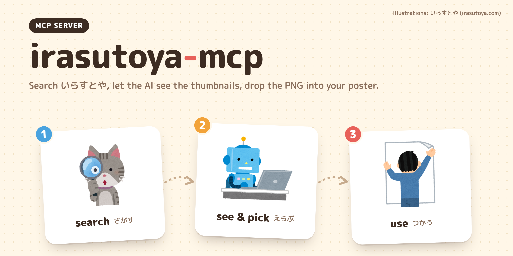

# irasutoya-mcp



[한국어](README.md) | [English](README.en.md) | **日本語**

[いらすとや](https://www.irasutoya.com)のイラストを検索・ダウンロードできる MCP サーバーです。検索結果をサムネイル画像と一緒に返すので、AI が実際に絵を見て、ポスターやスライドに合う素材を選べます。

> いらすとやとは関係のない非公式ツールです。このリポジトリでは素材の再配布は行っていません。上部のバナーは、いらすとやのイラストを使って制作したものです。画像はいらすとやの[ご利用について](https://www.irasutoya.com/p/faq.html)に従ってお使いください。

## ツール

| ツール | 動作 | 入力 |
|---|---|---|
| `search_illustrations` | 検索結果の JSON（タイトル、ラベル、説明文、元画像 URL）と 200px のサムネイル画像を返します。読み取り専用です。 | `keywords_ja: list[str]`, `limit: int = 8` |
| `download_illustration` | 元の PNG を指定したフォルダに保存し、保存先のパスを返します。 | `image_url: str`, `dest_dir: str` |

## インストール

[uv](https://docs.astral.sh/uv/) が必要です。

```bash
git clone https://github.com/sjoon21/irasutoya-mcp
cd irasutoya-mcp
uv sync
```

### Claude Code

このフォルダで `claude` を起動すると、`.mcp.json` に登録したサーバーが自動で読み込まれます。他のフォルダでも使う場合は、ユーザースコープで登録します。

```bash
claude mcp add -s user irasutoya -- uv run --directory /path/to/irasutoya-mcp server.py
```

### Claude Desktop、Cursor

設定ファイルの `mcpServers` に次の項目を追加します。

```json
{
  "irasutoya": {
    "command": "uv",
    "args": ["run", "--directory", "/path/to/irasutoya-mcp", "server.py"]
  }
}
```

## 使用例

> 会社の忘年会ポスターに使うイラストを3つ選んで、`~/Downloads/poster` に保存して。

## ご利用についての要点

- 商用利用は、1つの制作物につき20点まで可能です。
- 加工の有無にかかわらず、素材の再配布はできません。
- いらすとやの素材だと分からなくするための加工は控えるよう求められています。

## 開発

```bash
uv run pytest -q                       # 全テスト（実際のネットワークを使用）
uv run pytest -q -m "not integration"  # 単体テストのみ
```

設計方針とフィードの構造は [`CLAUDE.md`](CLAUDE.md)（韓国語）にまとめています。

## ライセンス

MIT
